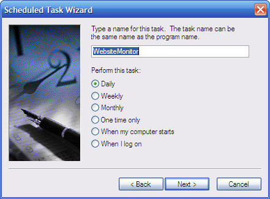

# Website Monitor

Originally posted here:
https://www.codeproject.com/Articles/74814/Website-Monitor

This program is a VBS script that checks your website every minute and warns you when it goes offline.

## Introduction
This program is a VBS script. The script checks regularly that your website is live. When your site goes offline, you will receive a popup that will go away in 15 seconds. If you click OK, the popup button you will open the test page in Internet Explorer. The program will also log the error into the log file (WebsiteMonitor.vbs.log) in the same folder as the script.

## Deployment
To deploy this program:
1. Copy Test.asp to your root folder (C:\Inetpub\wwwroot).
2. Modify the first line of the WebsiteMonitor.vbs file to point it to the Test.asp on your website.
3. The script has to be registered with the Windows Scheduler. Go to Control Panel > Scheduled Tasks > Add Scheduled Task. The script will run for about 24 hours, so it is important for it to be scheduled to run every day.
